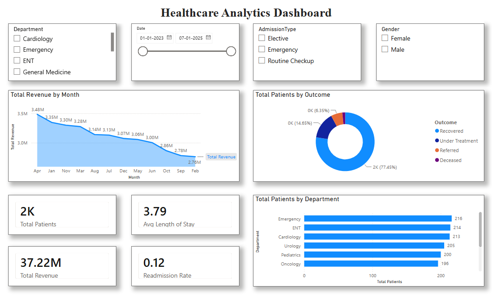
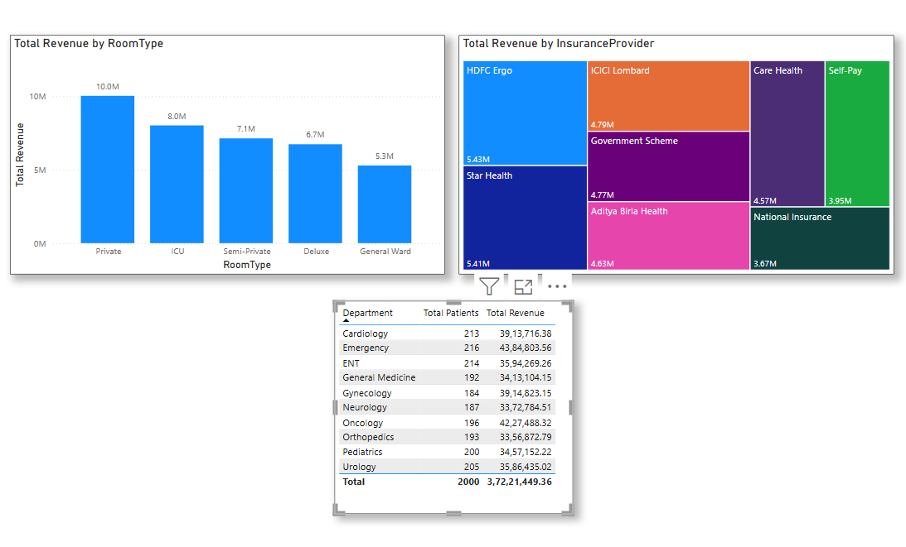
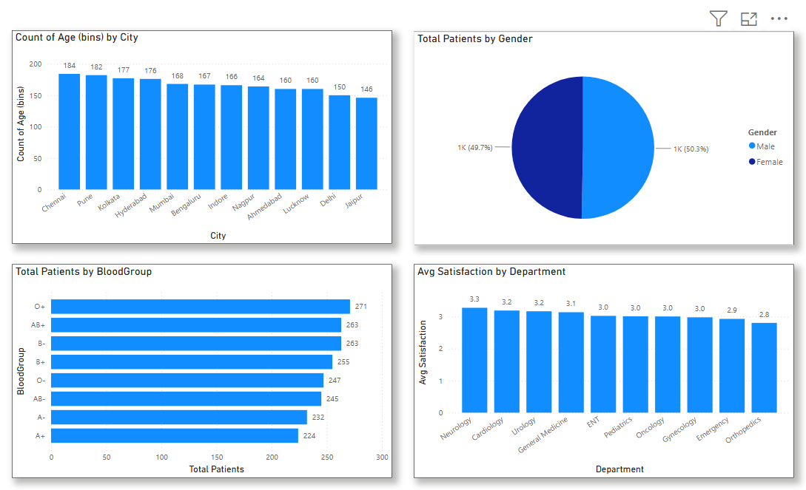

# Healthcare Analytics Dashboard | Power BI

An interactive healthcare analytics dashboard developed using Microsoft Power BI to analyze patient volume, revenue, demographics, and patient satisfaction metrics.

## 📊 Project Overview

This project provides an interactive view of healthcare data through multiple analytical perspectives. The dashboard helps analyze patient activity, financial performance, demographic patterns, and department-level healthcare metrics.

## 📌 Dashboard Pages

### 1. Overview

The Overview page provides a high-level summary of healthcare operations through key performance indicators and interactive visualizations.

Key metrics and analysis include:

- Total Patients
- Total Revenue
- Average Length of Stay
- Readmission Rate
- Patient Volume by Department
- Monthly Revenue Trend
- Patient Outcomes
- Interactive filtering by Department, Gender, Admission Type, and Date

### 2. Financial Analysis

The Financial page focuses on revenue and department-level financial analysis.

Analysis includes:

- Revenue by Room Type
- Revenue by Insurance Provider
- Patient and Revenue Analysis by Department

### 3. Demographics

The Demographics page provides insights into patient characteristics and satisfaction.

Analysis includes:

- Patient Distribution by City
- Patient Distribution by Gender
- Patient Distribution by Blood Group
- Average Satisfaction by Department

## 📊 Dataset

The dashboard is built using a healthcare dataset containing patient, admission, financial, demographic, and satisfaction-related information.

The dataset supports analysis across areas such as:

- Patient information
- Department
- Admission type
- Patient outcomes
- Room type
- Insurance provider
- Revenue
- Length of stay
- Gender
- Blood group
- City
- Patient satisfaction

> Note: The dataset is used for analytical and portfolio purposes.

## 🔄 Project Workflow

The dashboard development workflow follows these main steps:

1. Data Preparation
2. Data Modeling in Power BI
3. KPI and Measure Development
4. Interactive Visualization Development
5. Dashboard Design
6. Financial, Demographic, and Operational Analysis
7. Interactive Dashboard Exploration

### Workflow

Healthcare Data  
↓  
Data Preparation  
↓  
Power BI Data Model  
↓  
KPI & Measures  
↓  
Visualizations  
↓  
Interactive Dashboard  
↓  
Healthcare Insights

## 🛠️ Tools & Technologies

- Microsoft Power BI
- Data Analysis
- Data Visualization
- Business Intelligence
- Interactive Dashboard Development
- DAX

## 📈 Key Features

- Interactive dashboard navigation
- KPI cards
- Interactive slicers
- Time-based revenue analysis
- Department-level analysis
- Financial analysis
- Demographic analysis
- Healthcare performance analysis
- Interactive data visualizations

## 💡 Key Insights

The dashboard enables analysis of the following healthcare patterns:

- Compare patient volume across different departments.
- Monitor revenue trends over time.
- Analyze patient outcomes across the healthcare dataset.
- Compare revenue contribution across room types and insurance providers.
- Evaluate department-level patient volume and revenue.
- Understand patient demographic distribution across cities, genders, and blood groups.
- Compare average patient satisfaction across departments.
- Use interactive filters to explore healthcare metrics from different perspectives.

## 🎯 Project Objective

The objective of this project was to transform healthcare data into an interactive analytical dashboard that makes important operational, financial, demographic, and patient-related patterns easier to understand.

## 📂 Project Files

| File | Description |
|---|---|
| `Healthcare_Dashboard.pbix` | Power BI dashboard project file |
| `01-healthcare-dashboard-overview.png` | Overview dashboard screenshot |
| `02-healthcare-dashboard-financial.png` | Financial analysis dashboard screenshot |
| `03-healthcare-dashboard-demographics.png` | Demographics dashboard screenshot |

## 🖥️ Dashboard Preview

### 1. Overview

### 2. Financial Analysis

### 3. Demographics

## ▶️ How to Use

1. Download `Healthcare_Dashboard.pbix` from this repository.
2. Open the file using Microsoft Power BI Desktop.
3. Navigate through the Overview, Financial, and Demographics pages.
4. Use the available slicers and interactive visuals to explore the healthcare data.
5. Interact with the dashboard to analyze patient, financial, demographic, and satisfaction metrics.

## 👤 Author

**Tejas Surana**

Aspiring Data Analyst | AI & FinTech | Power BI | SQL | Python | Excel
